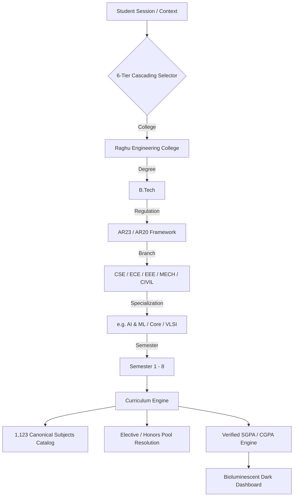

<div align="center">

# ⚡ StudIQ: Operational Student Intelligence & Exact Curriculum Analytics Platform

<p align="center">
  <strong>Enterprise-grade student self-service academic intelligence cockpit, 6-parameter deterministic curriculum resolution engine, and verified SGPA/CGPA analytics platform.</strong>
</p>

[](https://student-perfomace-tracker.onrender.com/)
[](https://www.python.org/)
[](https://flask.palletsprojects.com/)
[](https://dash.plotly.com/)
[](https://gunicorn.org/)
[](https://www.sqlalchemy.org/)
[](https://student-perfomace-tracker.onrender.com/)
[](https://opensource.org/licenses/MIT)

</div>

---

## 📑 Table of Contents

- [Executive Overview & Platform Scale](#-executive-overview--platform-scale)
- [Key Architectural Capabilities](#-key-architectural-capabilities)
- [System Architecture & Technology Stack](#-system-architecture--technology-stack)
- [Live Application Routes & Routing Flow](#-live-application-routes--routing-flow)
- [Deterministic Academic & Calculation Engine](#-deterministic-academic--calculation-engine)
- [Repository Structure](#-repository-structure)
- [Developer Setup & Local Installation](#-developer-setup--local-installation)
- [Render Cloud Deployment Architecture](#-render-cloud-deployment-architecture)
- [Grade Point Mapping Reference](#-grade-point-mapping-reference)
- [Testing & Quality Assurance](#-testing--quality-assurance)
- [License & Academic Governance](#-license--academic-governance)

---

## 🏛️ Executive Overview & Platform Scale

**StudIQ** is a production-grade academic performance intelligence and curriculum management platform designed specifically for autonomous engineering institutions. Traditional student portals and spreadsheets rely on generic estimation, flat subject catalogs, or manual credit entry. StudIQ replaces these failure points with **deterministic, 6-parameter cascading resolution**, strict regulation boundaries, automated elective pool isolation, and verified SGPA/CGPA accounting.

Built on an ephemeral-resilient foundation, StudIQ features **zero-configuration cold-start bootstrapping** that dynamically initializes schema, institutional entities, regulations, branches, and full course catalogs on cloud deployment without relying on a pre-existing local `.db` file.

```
                                 STUDIQ INSTITUTIONAL SCALE (REC AUTONOMOUS)
  ┌─────────────────────────┬─────────────────────────┬─────────────────────────┬─────────────────────────┐
  │         1,123           │           18            │           21            │           205           │
  │   Canonical Subjects    │    Unique Curricula     │  Branch Specializations │    Elective Options     │
  └─────────────────────────┴─────────────────────────┴─────────────────────────┴─────────────────────────┘
```

### Institutional Coverage: Raghu Engineering College (REC Autonomous)
StudIQ ships with the complete verified curriculum repository for **Raghu Engineering College (Autonomous)** across all four undergraduate years (Semesters 1 through 8):

- **Canonical Subject Catalog**: **1,123 verified course records** with official credit weights, course codes, contact hours, and verification metadata.
- **Autonomous Regulation Isolation**: Complete structural separation between **AR23** and **AR20** regulation frameworks.
- **21 Registered Branch & Specialization Combinations**:
  - **Computer Science & Engineering (CSE)**: Core Computer Science, Artificial Intelligence & Machine Learning (AI & ML), Data Science, Cyber Security, IoT & Blockchain (AR23), IoT & Embedded Systems (AR20).
  - **Electronics & Communication Engineering (ECE)**: VLSI & Embedded Systems.
  - **Electrical & Electronics Engineering (EEE)**: Power Systems & Automation (AR23), Power Systems (AR20).
  - **Mechanical Engineering (MECH)**: Design & Manufacturing (AR23), Thermal & Design (AR20).
  - **Civil Engineering (CIVIL)**: Structural Engineering.
- **205 Categorized Elective Pools**: Professional Electives (PE-I through PE-V), Open Electives (OE-I through OE-IV), Honors, and Minors tracks.

---

## 🌟 Key Architectural Capabilities



### 1. Deterministic 6-Parameter Cascading Resolution
Curricula are resolved deterministically using a cascading academic path:
$$\text{College} \longrightarrow \text{Degree} \longrightarrow \text{Regulation} \longrightarrow \text{Branch} \longrightarrow \text{Specialization} \longrightarrow \text{Semester}$$
This prevents cross-regulation contamination (e.g., merging AR20 and AR23 subjects) and ensures exact course code alignment for every semester.

### 2. Verified vs. Estimated vs. Incomplete Calculation Engine
StudIQ computes semester grade point averages with strict credit verification and classification:
$$\text{SGPA} = \frac{\sum_{i=1}^{n} (\text{Grade Point}_i \times \text{Credits Used}_i)}{\sum_{i=1}^{n} \text{Credits Used}_i}$$

- **Zero-Credit Audit Course Exclusions**: Mandatory non-credit courses (e.g., *23MC601 Environmental Science*, Induction Programs, Audit Courses) are automatically excluded from the SGPA denominator.
- **Audited Status Tagging**:
  - `VERIFIED_SGPA`: 100% of credits match official autonomous course structures.
  - `ESTIMATED_SGPA`: Triggered when custom or student-entered credits are utilized.
  - `INCOMPLETE_SGPA`: Warns students of uncredited subjects without crashing arithmetic execution.

### 3. Dynamic Elective, Open Elective & Honors Pools
- **Single-Course Selection Constraint**: Enforces choosing at most 1 course per elective bucket (e.g., Professional Elective I in Sem 5), preventing double-counting.
- **Dynamic Credit Re-balancing**: Unselected electives remain dormant; selecting an elective dynamically binds its credit weight to the active transcript and updates SGPA calculations in real time.

### 4. Futuristic Bioluminescent Glassmorphism Visuals
- **Glowing Cyan/Teal Gradient Bar Charts**: Attendance and subject performance visualizers built with custom SVG linear gradients (`bg-gradient-to-t from-cyan-500/20 to-cyan-400`).
- **Statutory 75% Attendance Compliance Monitor**: Live bar visualizer with amber-line threshold markers for semester exam eligibility.
- **Zero-Flash Responsive Grid**: Fully responsive CSS Grid layouts (`grid-cols-1 md:grid-cols-2 lg:grid-cols-3`) with mobile-optimized touch targets.

---

## 🛠️ System Architecture & Technology Stack

| Layer | Technologies | Role & Purpose |
| :--- | :--- | :--- |
| **WSGI Server** | **Gunicorn 21.2+** | Production HTTP/WSGI server with multi-worker concurrency and signal handling. |
| **Web Core** | **Flask 3.0+** | Routing, HTTP middleware, session management, and template rendering. |
| **Frontend Cockpit** | **Plotly Dash 3.0+** & **Dash Bootstrap Components** | Reactive Single-Page Application (SPA) dashboard with dynamic subpage callbacks. |
| **Styling & UI** | **Tailwind CSS**, Glassmorphism CSS, Bootstrap 5.3 | Pure Black (`#000000`) Vesper dark theme, custom grain overlay, and responsive layouts. |
| **Data Visualization** | **Plotly 5.18+** | Interactive SVG/WebGL charts (SGPA trendline, attendance distribution, grade gauges). |
| **ORM & Database** | **SQLAlchemy 2.0+** & **SQLite 3** | Declarative relational data models, connection pooling, and multi-thread transaction safety. |
| **Data Processing** | **Pandas 2.2+**, **NumPy 1.26+**, **OpenPyXL** | Curriculum CSV parsing, data transformations, and formatted Excel marksheet exports. |
| **Machine Learning** | **Scikit-Learn 1.4+**, **XGBoost 2.0+**, **SHAP** | Academic risk assessment, pass/fail prediction, and study roadmap synthesis. |
| **Authentication** | **Flask-Login 0.6+**, **Werkzeug Security** | Secure password hashing (`pbkdf2:sha256`), role enforcement, and session binding. |

---

## 🌐 Live Application Routes & Routing Flow

```
                      STUDIQ ROUTE HIERARCHY & AUTHENTICATION FLOW
  
        Public / Root Entry Points                      Interactive Demo
     ┌──────────────────────────────┐              ┌────────────────────────┐
     │  / or /home (Direct HTML)    │              │  /demo or /app/demo    │
     │  /app/ (Public Hero Landing) │              │  (Instant Rahul Kumar) │
     └──────────────┬───────────────┘              └───────────┬────────────┘
                    │                                          │
                    ▼                                          ▼
     ┌──────────────────────────────┐              ┌────────────────────────┐
     │      /login & /register      │              │ /app/overview (Cockpit)│
     │ (Vesper Dark Auth Portal)    │              │ - SGPA & CGPA Cards    │
     └──────────────┬───────────────┘              │ - Subject Marksheets   │
                    │                              │ - Attendance Visuals   │
                    ▼                              │ - Analytics Charts     │
     ┌──────────────────────────────┐              │ - Academic Profile     │
     │  Protected Dashboard Views   │─────────────►│ - Session Settings     │
     └──────────────────────────────┘              └────────────────────────┘
```

### Complete Route Specifications

| Route Path | Access Type | Description |
| :--- | :---: | :--- |
| **`/`**, **`/home`** | Public | Direct, high-performance HTML landing page with zero JavaScript overhead and instant video background. |
| **`/app/`**, **`/app/landing`** | Public | Public Hero Landing Page rendered within the Dash application without requiring prior authentication. |
| **`/demo`**, **`/app/demo`** | Public (Demo) | Instant demo bypass that authenticates the user as Rahul Kumar (AR23 CSE Sem 3) with pre-loaded marks and attendance. |
| **`/login`**, **`/register`** | Public | Pure Black Vesper authentication interface supporting credential validation and new student enrollment. |
| **`/app/overview`** | Protected / Demo | Primary student overview displaying core KPIs (SGPA, CGPA, total credits, risk classification). |
| **`/app/analytics`** | Protected / Demo | Multi-term SGPA progression trendline, subject-wise score distribution, and predictive radar charts. |
| **`/app/marks-subjects`** | Protected / Demo | Canonical course transcript table, dynamic elective selector, and interactive marks entry modal. |
| **`/app/attendance`** | Protected / Demo | Statutory attendance tracker with glowing cyan/teal bar visualizer and exam clearance metrics. |
| **`/app/academic-profile`** | Protected / Demo | 6-card responsive institutional grid showing verified roll ID, college, regulation, and department. |
| **`/app/settings`** | Protected / Demo | Session management, password updates, and clean flex-column sign-out controls. |
| **`/logout`** | Session | Terminates active user session and redirects to the public landing page. |

---

## 🔬 Deterministic Academic & Calculation Engine

### 1. Mathematical Formulas

$$\text{SGPA} = \frac{\sum_{i=1}^{m} (\text{Grade Point}_i \times \text{Credits}_i)}{\sum_{i=1}^{m} \text{Credits}_i} \quad \text{where } \text{Credits}_i > 0 \text{ and } \text{Type}_i \neq \text{"AUDIT"}$$

$$\text{CGPA} = \frac{\sum_{j=1}^{k} (\text{SGPA}_j \times \text{Total Credits}_j)}{\sum_{j=1}^{k} \text{Total Credits}_j}$$

$$\text{Attendance Compliance (\%)} = \left( \frac{\text{Classes Attended}}{\text{Total Conducted Classes}} \right) \times 100 \ge 75.0\%$$

### 2. Status Hierarchy & Fail-Safe Fallbacks
```
                   CALCULATION STATUS DETERMINATION
                   
             Are all enrolled course credits official?
                           /           \
                         YES            NO
                         /                \
          [VERIFIED_SGPA]           Is any credit student-entered?
         (Official Verified)                /             \
                                          YES              NO (Missing credit)
                                          /                 \
                                  [ESTIMATED_SGPA]      [INCOMPLETE_SGPA]
                                 (Estimated Marker)    (Non-crashing Alert)
```

---

## 📁 Repository Structure

```
student_performance_tracker/
├── app/
│   ├── __init__.py                  # Application package initialization
│   ├── config.py                    # Environment variables, database URIs & secrets
│   ├── main.py                      # Flask app, Dash initialization & route handlers
│   ├── auth.py                      # Flask-Login, PBKDF2 authentication & demo session
│   ├── database.py                  # SQLAlchemy ORM models & init_db() auto-seeder
│   ├── curriculum_engine.py         # 6-parameter cascading resolution & SGPA engine
│   ├── curriculum_loader.py         # Multi-path CSV/JSON importer & validation reporter
│   ├── callbacks.py                 # Dash reactive callbacks (cascading filters, modals, charts)
│   ├── utils.py                     # Grade scales, calculation helpers & Excel exporter
│   ├── ml_models/                   # Machine learning training & prediction modules
│   │   ├── train_models.py          # Synthetic dataset generator & model trainer
│   │   └── predict.py               # Risk classifier & study roadmap synthesizer
│   └── dashboards/                  # Modular UI layouts & subpages
│       ├── __init__.py
│       ├── components.py            # KPI widgets, bioluminescent cards & export bars
│       ├── hero_page.py             # Public SaaS hero landing page layout
│       ├── layout_shell.py          # Framer-style navigation dock & cockpit shell
│       ├── student_dashboard.py     # Main student dashboard container
│       └── pages/                   # Subpage components
│           ├── overview_page.py     # Primary KPI summary page
│           ├── analytics_page.py    # Plotly performance charts & trends
│           ├── marks_subjects_page.py # Transcript marksheet & elective modal
│           ├── attendance_page.py   # Attendance compliance visualizer
│           ├── academic_profile_page.py # Multi-column verified student profile
│           └── settings_page.py     # Session & security settings
├── data/
│   ├── official_curricula.csv       # Master canonical curriculum data (1,123 subjects)
│   ├── rec_parsed_structures.json   # Parsed JSON department course structures
│   ├── sample_data.sql              # Standard SQL database seed script
│   └── generate_seed_data.py        # Synthetic test dataset generation script
├── tests/
│   ├── __init__.py
│   ├── test_curriculum_accuracy.py  # 11 unit tests for curriculum isolation & SGPA math
│   └── test_platform.py             # Integration tests for auth, ORM & reporting
├── assets/                          # Custom CSS, Tailwind utilities & video assets
│   ├── styles.css                   # Bioluminescent glassmorphic stylesheet
│   └── animations.js                # UI motion transitions
├── requirements.txt                 # Pinned production dependencies
└── README.md                        # Master repository documentation
```

---

## 💻 Developer Setup & Local Installation

### 1. Prerequisites
- **Python 3.10**, **3.11**, or **3.12**
- **Git**

### 2. Clone Repository & Create Virtual Environment
```bash
# Clone repository
git clone https://github.com/your-username/student-performance-tracker.git
cd student-performance-tracker

# Create virtual environment
python -m venv venv

# Activate virtual environment
# Windows (PowerShell):
.\venv\Scripts\Activate.ps1
# Windows (cmd.exe):
.\venv\Scripts\activate.bat
# Linux / macOS:
source venv/bin/activate
```

### 3. Install Dependencies
```bash
pip install --upgrade pip
pip install -r requirements.txt
```

### 4. Run Automated Test Suite
Execute the comprehensive unit test suite to verify curriculum resolution, regulation isolation, and SGPA calculations:
```bash
python -m unittest tests/test_curriculum_accuracy.py -v
```

### 5. Launch the Local Development Server
```bash
# Option A: Direct Python Execution
python app/main.py

# Option B: Gunicorn WSGI Production Emulation
gunicorn app.main:server --bind 127.0.0.1:8050 --workers 2
```

Navigate to **`http://127.0.0.1:8050`** in your browser.

---

## ☁️ Render Cloud Deployment Architecture

StudIQ is engineered for zero-configuration, continuous cloud deployment on platforms like **Render**, **Railway**, or **AWS/GCP**:

```
                       RENDER CLOUD BUILD & BOOTSTRAP FLOW
                       
      [Git Push to Main]
              │
              ▼
   ┌──────────────────────┐
   │ Render Build Hook    │ ──► pip install -r requirements.txt
   └──────────┬───────────┘
              │
              ▼
   ┌──────────────────────┐
   │ Gunicorn WSGI Start  │ ──► gunicorn app.main:server --bind 0.0.0.0:$PORT
   └──────────┬───────────┘
              │
              ▼
   ┌──────────────────────┐
   │ bootstrap_application│ ──► 1. init_db() [Creates tables, grade scales, branches]
   │ (Automated Seeding)  │ ──► 2. ensure_curricula_loaded() [Loads 1,123 subjects]
   │                      │ ──► 3. seed_default_users() [Seeds demo accounts & marks]
   └──────────┬───────────┘
              │
              ▼
   [Live Production Cockpit Serving Traffic at student-perfomace-tracker.onrender.com]
```

### Ephemeral Cloud File Resilience
1. **Tracked Master Datasets**: Both `data/official_curricula.csv` and `data/rec_parsed_structures.json` are committed to source control.
2. **Multi-Path Probing**: `find_curriculum_data_file()` dynamically searches `BASE_DIR / data`, Render runtime paths (`/opt/render/project/src/data`), and local working directories.
3. **Idempotent Seeding**: If an ephemeral container restarts and creates a fresh SQLite database, `bootstrap_application()` runs automatically on worker initialization, ensuring zero downtime and complete data integrity without manual database migrations.

---

## 📊 Grade Point Mapping Reference

| Marks Range (%) | Letter Grade | Grade Point | Autonomous Academic Standing |
| :---: | :---: | :---: | :--- |
| **$90 - 100\%$** | **O** | **10.0** | Outstanding |
| **$80 - 89\%$** | **A+** | **9.0** | Excellent |
| **$70 - 79\%$** | **A** | **8.0** | Very Good |
| **$60 - 69\%$** | **B+** | **7.0** | Good |
| **$50 - 59\%$** | **B** | **6.0** | Above Average |
| **$40 - 49\%$** | **C** | **5.0** | Pass |
| **$< 40\%$** | **F** | **0.0** | Fail / Arrear |

---

## 🧪 Testing & Quality Assurance

StudIQ includes unit and integration tests covering data integrity and calculation formulas:

```bash
# Run all unit tests
python -m unittest discover tests/ -v

# Run curriculum accuracy tests specifically
python -m unittest tests/test_curriculum_accuracy.py -v
```

### Key Verification Checkpoints
- **Test AR20 vs AR23 Isolation**: Verifies that AR20 and AR23 course structures never share foreign keys or pollute cross-regulation queries.
- **Test Audit Course Exclusions**: Validates that zero-credit mandatory courses are excluded from the SGPA divisor.
- **Test Elective Deduplication**: Ensures that multiple courses from the same elective group cannot be simultaneously credited.
- **Test Exact 6-Tier Matching**: Validates deterministic retrieval of courses across all 21 branch specializations.

---

## 🛡️ License & Academic Governance

This project is licensed under the **MIT License** — see the [LICENSE](LICENSE) file for complete details.

### Academic Disclaimer
*StudIQ is an independent academic performance tracking and analytics platform. Course structure data is referenced from official autonomous regulations of Raghu Engineering College for academic tracking purposes.*

---

<div align="center">
  <sub>Developed with ⚡ by the StudIQ Engineering Team. Operational Student Intelligence.</sub>
</div>
